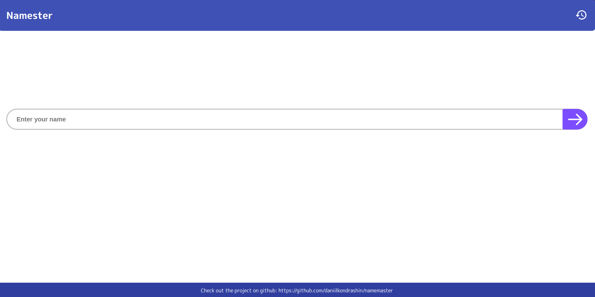

# Namemaster project
The namemaster project is a simple web application for testing the deployment and learning of kubernetes. The user enters his name in the field and receives a response. The user's name is recorded in the database. All the names can be viewed in the history.

## Docker
Build the images and spin up the containers:
```sh
docker-compose -f docker-compose.yaml up --build
```
## Kubernetes
**Install namemaster**

Creating a namespace:

```sh
kubectl create namespace namemaster
```
Installing namemaster
```sh
helm upgrade --install namemaster .helm/namemaster --namespace namemaster
```

**Configuration**

The following table lists the configurable parameters of the nextcloud chart and their default values.

|        Parameter             |         Description                              |       Default             |
| ------                       | ------                                           | ------                    |
| `image.repository`           | namemaster Image name                            | `daniil3680/namemaster`   |
| `image.pullPolicy`           | Image pull policy                                | `IfNotPresent`            |
| `image.tag`                  | namemaster Image tag                             | `latest`                  |
| `serviceAccount.create`      | Enable Role and role binding for priveledged PSP | `false`                   |
| `serviceAccount.annotations` | Serviceaccount annotations                       | `{}`                      |
| `serviceAccount.name`        | The name of the service account that the deployment will use (requires rbac) | `nil`         |
| `rbac.create`                | Create rbac Role and RoleBinding                 | `false`                   |
| `rbac.annotations`           | rbac Role and RoleBinding annotations            | `{}`                      |
| `rbac.namesecret`            | Secret name for serviceaccount              | `namemaster-serviceaccount-secret`|
| `podAnnotations`             | Annotations to be added at 'pod' level           | `not set`                 |
| `podLabels`                  | Labels to be added at 'pod' level                | `not set`                 |
| `podSecurityContext`         | Optional security context for the namemaster pod (applies to all containers in the pod)| `not set`|
| `securityContext`            | Optional security context for the NextCloud container| `not set`             |
| `service.type`               | Kubernetes Service type                           | `ClusterIP`              |
| `service.port`               | Kubernetes Service port                           | `80`                     |
| `ingress.enabled`            | Enable use of ingress controllers                 | `false`                  |
| `ingress.className`          | Name of the ingress class to use                  | `nil`                    |
| `ingress.annotations`        | An array of service annotations                   | `nil`                    |
| `ingress.host`               | namemaster host                                   | `nil`                    |
| `ingress.path`               | The `Path` to use in Ingress' `paths`             | `/`                      |
| `ingress.pathType`           | The `PathType` to use in Ingress' `paths`         | `Prefix`                 |
| `ingress.tls`                | Ingress TLS configuration                         | `[]`                     |
| `postgresql.username`        | username postgres                                 | `postgres`               |
| `postgresql.password`        | password postgres                                 | `db_password`            |
| `postgresql.host`            | host postgres                                     | `postgresql`             |
| `postgresql.port`            | port postgres                                     | `5432`                   |
| `postgresql.database`        | database postgres                                 | `postgres`               |
| `namemaster.secretkey`       | secret key for namemaster operation               | `''`                     |
| `resources`                  | CPU/Memory resource requests/limits               | `{}`                     |
| `autoscaling.enabled`        | Boolean to create a HorizontalPodAutoscaler       | `false`                  |
| `autoscaling.minReplicas`    | Min. pods for the namemaster HorizontalPodAutoscaler | `1`                   |
| `autoscaling.targetCPUUtilizationPercentage`| CPU threshold percent for the HorizontalPodAutoscale | `80`   |
| `autoscaling.targetMemoryUtilizationPercentage`| Memory threshold percent for the HorizontalPodAutoscale | `80`   |

Generate a token and paste it into namemaster.secretkey

**Install postgresql**

```sh
helm install postgresql bitnami/postgresql --namespace namemaster
```
Enter the postgresql password in postgresql.password
