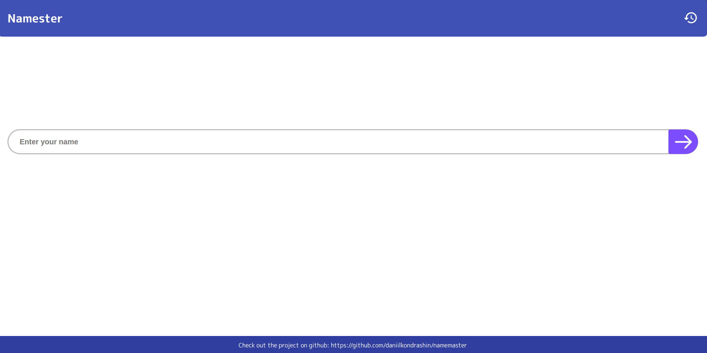

# Namemaster project
The namemaster project is a simple web application for testing the deployment and learning of kubernetes. The user enters his name in the field and receives a response. The user's name is recorded in the database. All the names can be viewed in the history.

## Docker
Build the images and spin up the containers:
```sh
docker-compose -f docker-compose.yaml up --build
```
## Kubernetes
**Install namemaster**

Creating a namespace:

```sh
kubectl create namespace namemaster
```
Installing namemaster
```sh
helm upgrade --install namemaster .helm/namemaster --namespace namemaster
```

**Configuration**

The following table lists the configurable parameters of the nextcloud chart and their default values.

|        Parameter             |         Description                              |       Default             |
| ------                       | ------                                           | ------                    |
| `image.repository`           | namemaster Image name                            | `daniil3680/namemaster`   |
| `image.pullPolicy`           | Image pull policy                                | `IfNotPresent`            |
| `image.tag`                  | namemaster Image tag                             | `latest`                  |
| `rbac.create`                | Create rbac Role and RoleBinding                 | `false`                   |
| `rbac.annotations`           | rbac Role and RoleBinding annotations            | `{}`                      |
| `rbac.namesecret`            | Secret name for serviceaccount                   | `namemaster-serviceaccount-secret`|
| `rbac.name`                  | Serviceaccount name                              | `namemaster-serviceaccount`|
| `podAnnotations`             | Annotations to be added at 'pod' level           | `not set`                 |
| `podLabels`                  | Labels to be added at 'pod' level                | `not set`                 |
| `podSecurityContext`         | Optional security context for the namemaster pod (applies to all containers in the pod)| `not set`|
| `securityContext`            | Optional security context for the NextCloud container| `not set`             |
| `service.type`               | Kubernetes Service type                           | `ClusterIP`              |
| `service.port`               | Kubernetes Service port                           | `80`                     |
| `gateway.enabled`            | Create Gateway API Gateway and HTTPRoute          | `false`                  |
| `gateway.className`          | GatewayClass name managed by NGINX Gateway Fabric | `nginx`                  |
| `gateway.hostname`           | Public hostname for Gateway and HTTPRoute         | `example.online`         |
| `gateway.annotations`        | Gateway annotations, including cert-manager issuer | `cert-manager.io/cluster-issuer: letsencrypt-prod` |
| `gateway.tls.enabled`        | Enable HTTPS listener on the Gateway              | `true`                   |
| `gateway.tls.secretName`     | TLS secret created by cert-manager                | `namemaster-tls`         |
| `gateway.route.paths`        | HTTPRoute path matches                            | `/`                      |
| `postgresql.username`        | username postgres                                 | `namemaster`             |
| `postgresql.existingSecret.name` | Existing Secret with database password        | `postgresql`             |
| `postgresql.existingSecret.passwordKey` | Password key in existing Secret        | `password`               |
| `postgresql.host`            | host postgres                                     | `postgresql`             |
| `postgresql.port`            | port postgres                                     | `5432`                   |
| `postgresql.database`        | database postgres                                 | `namemaster`             |
| `namemaster.secretkey`       | secret key for namemaster operation               | `''`                     |
| `resources`                  | CPU/Memory resource requests/limits               | `{}`                     |
| `autoscaling.enabled`        | Boolean to create a HorizontalPodAutoscaler       | `false`                  |
| `autoscaling.minReplicas`    | Min. pods for the namemaster HorizontalPodAutoscaler | `1`                   |
| `autoscaling.maxReplicas`    | Max. pods for the namemaster HorizontalPodAutoscaler | `10`                  |
| `autoscaling.targetCPUUtilizationPercentage`| CPU threshold percent for the HorizontalPodAutoscale | `80`   |
| `autoscaling.targetMemoryUtilizationPercentage`| Memory threshold percent for the HorizontalPodAutoscale | `80`   |

Generate a token and paste it into namemaster.secretkey

**Install postgresql**

```sh
helm install postgresql bitnami/postgresql --namespace namemaster
```
Enter the postgresql password in postgresql.password

## Terraform remote state

Bootstrap the S3 bucket first:

```sh
cd terraform/backend
terraform init
terraform apply
```

Then copy the generated bucket name into the backend configs:

```sh
terraform output -raw state_bucket_name
cp ../k8s/backend.hcl.example ../k8s/backend.hcl
cp ../helm/backend.hcl.example ../helm/backend.hcl
```

Replace the placeholder bucket value in both `backend.hcl` files, then initialize the stacks:

```sh
cd ../k8s
terraform init -backend-config=backend.hcl -migrate-state

cd ../helm
terraform init -backend-config=backend.hcl -migrate-state
terraform apply -var="terraform_state_bucket=<state-bucket-name>"
```
